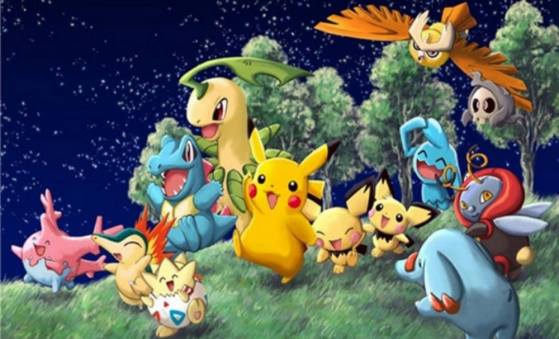
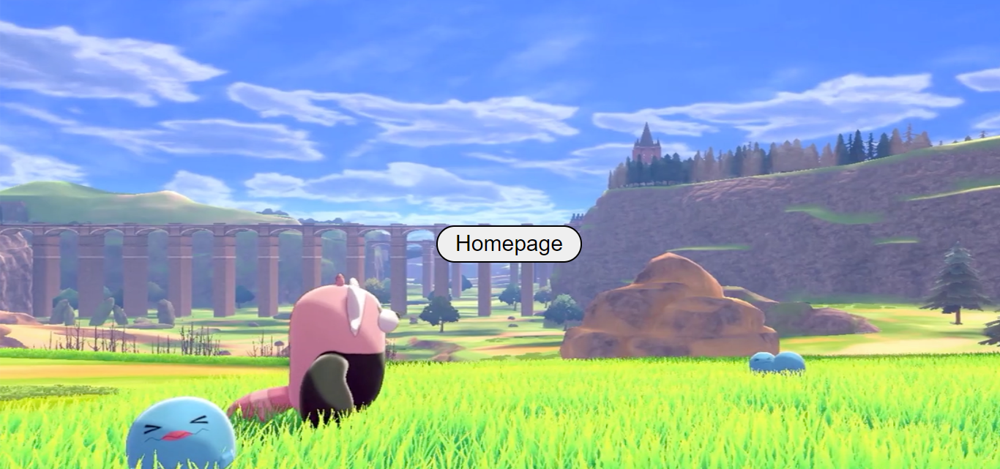
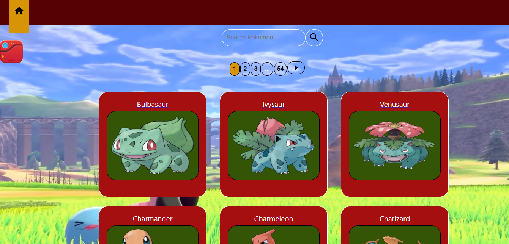
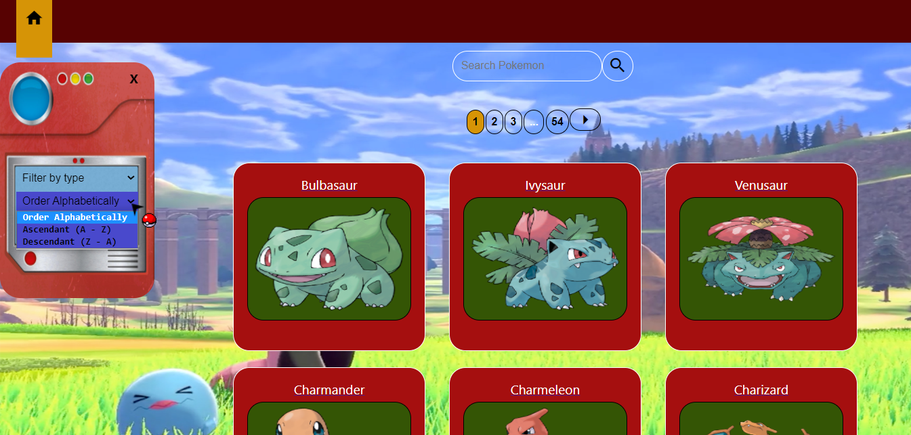
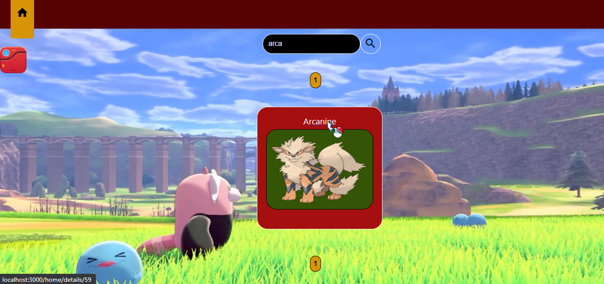
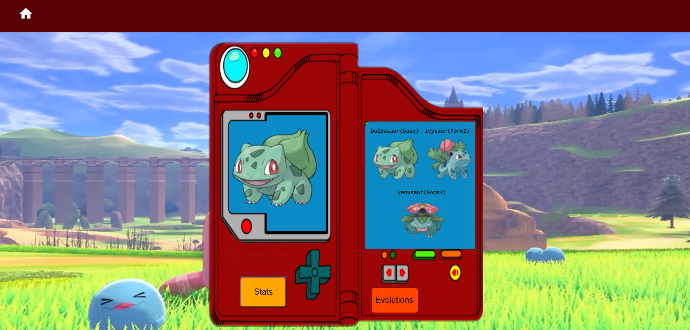

# Pokemon-App

  

#### Start API 🔧
`cd api`
`npm install`
`npm start`

#### Start Client🔧
`cd client`
`npm install`
`npm start`

#### Project built with
- [ ] React
- [ ] Redux
- [ ] Express
- [ ] PostgreSQL

